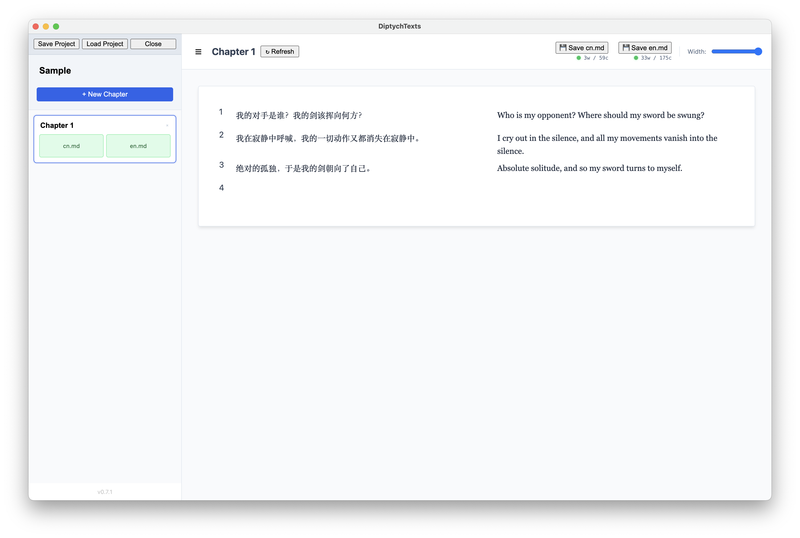
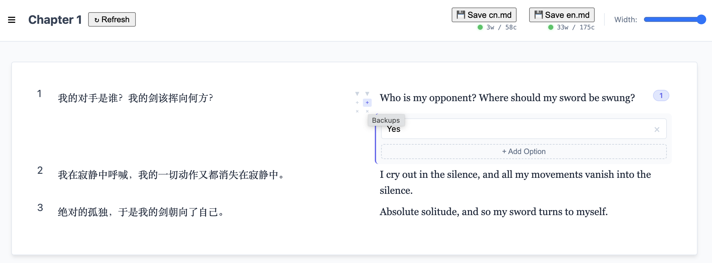

# DiptychTexts

**Align your thoughts. Translate in flow.**

DiptychTexts is a minimalist, local-first side-by-side text editor designed for translators and bilingual writers. It replaces clunky spreadsheets and disconnected documents with a clean, continuous "Document Mode" that keeps your source and target text perfectly aligned.

## Key Features
* 📄 Document Flow: No more rigid boxes. Write in a continuous, paper-like interface that handles paragraph alignment automatically.
* 🗄️ Backup System: Keep your drafts clean. Store alternative translation options or previous versions inside hidden "Backup Cards" attached to every paragraph.
* 🔒 Local & Private: Your data never leaves your device. All work is saved instantly to your browser's local database.
* ⚡ Smart Controls: Minimalist center controls to Insert (▼), Add Backup (+), or Delete (×) paragraphs without clutter.

## A Closer Look

### The Backup System
Never lose a "maybe better" translation again. Click the + button to store alternative versions without cluttering your final text.

## How to Run
Since browsers block some features for local files, use the included launcher script:
* Mac/Linux: Double-click RunEditor.command

## Shortcut & Controls

| Icon         | Action         | Description                                          |
|--------------|----------------|------------------------------------------------------|
| ▼            | Insert Below   | Pushes text down to create a new empty gap.          |
| +            | Backup         | Toggles the hidden backup drawer for alternatives.   |
| ×            | Delete         | Removes the paragraph and pulls text up.             |
| ☰            | Toggle Sidebar | Hides the chapter list for distraction-free writing. |
| Cmd/Ctrl + S | Quick Save     | Forces an immediate save to local storage.           |